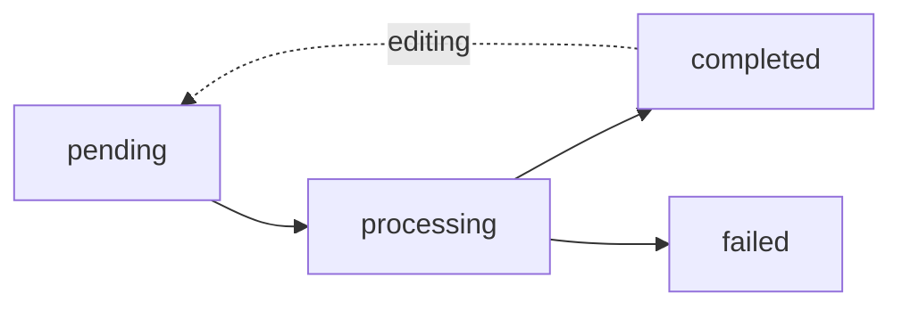

## Overview

Image generation operations in AI Studio are asynchronous. Each image goes through multiple status states from initial creation to completion. This guide explains the status lifecycle and how to track processing progress.

## Status Values

The `imageGeneration` table includes a `status` field with the following possible values:

<ResponseField name="pending" type="string">
  Initial state after image upload. The image is queued for processing but hasn't started yet.
</ResponseField>

<ResponseField name="processing" type="string">
  The image is currently being processed by the AI model. This typically takes 10-30 seconds.
</ResponseField>

<ResponseField name="completed" type="string">
  Processing finished successfully. The `resultImageUrl` field contains the processed image URL.
</ResponseField>

<ResponseField name="failed" type="string">
  Processing encountered an error. The `errorMessage` field contains details about what went wrong.
</ResponseField>

## Status Lifecycle



### Normal Flow

1. **pending** - Image created, waiting for processing to start
2. **processing** - AI model is enhancing the image
3. **completed** - Result is ready and stored

### Error Flow

1. **pending** - Image created, waiting for processing
2. **processing** - AI processing started
3. **failed** - An error occurred (with error message)

## Image Generation Schema

```typescript
interface ImageGeneration {
  id: string;
  workspaceId: string;
  userId: string;
  projectId: string;
  
  // Image URLs
  originalImageUrl: string;      // Source image (always present)
  resultImageUrl: string | null; // Processed image (null until completed)
  
  // AI parameters
  prompt: string;                // Style transformation prompt
  
  // Version tracking
  version: number;               // 1, 2, 3... for edit history
  parentId: string | null;       // Links to root image for versioning
  
  // Status tracking
  status: "pending" | "processing" | "completed" | "failed";
  errorMessage: string | null;   // Error details if status is failed
  
  // Additional info
  metadata: {
    editedFrom?: string;         // Previous version ID
    editedAt?: string;           // ISO timestamp
    editMode?: "remove" | "add"; // For inpaint operations
    model?: string;              // AI model used
  } | null;
  
  createdAt: Date;
  updatedAt: Date;
}
```

## Checking Status

### Using Database Queries

Query the image generation record directly:

```typescript
import { getImageGenerationById } from '@/lib/db/queries';

const image = await getImageGenerationById(imageId);

console.log('Status:', image.status);

if (image.status === 'completed') {
  console.log('Result URL:', image.resultImageUrl);
}

if (image.status === 'failed') {
  console.error('Error:', image.errorMessage);
}
```

### Polling Pattern

For real-time status updates, implement a polling pattern:

```typescript
async function waitForCompletion(imageId: string, maxAttempts = 60) {
  for (let i = 0; i < maxAttempts; i++) {
    const image = await getImageGenerationById(imageId);
    
    if (image.status === 'completed') {
      return { success: true, resultUrl: image.resultImageUrl };
    }
    
    if (image.status === 'failed') {
      return { success: false, error: image.errorMessage };
    }
    
    // Wait 2 seconds before next check
    await new Promise(resolve => setTimeout(resolve, 2000));
  }
  
  throw new Error('Timeout waiting for image processing');
}
```

## Real-Time Progress Tracking

### Using Trigger.dev Metadata

When processing via Trigger.dev background jobs, you can track detailed progress:

```typescript
interface ProcessImageStatus {
  step: "fetching" | "uploading" | "processing" | "saving" | "completed" | "failed";
  label: string;
  progress?: number;
}

interface InpaintImageStatus {
  step: "fetching" | "preparing" | "processing" | "saving" | "completed" | "failed";
  label: string;
  progress?: number;
}
```

### Progress Steps

#### Process Image Flow

<Steps>
  <Step title="Fetching">
    Loading image record from database
    
    **Progress**: 10%
  </Step>
  
  <Step title="Uploading">
    Preparing image for AI processing (uploading to Fal.ai storage)
    
    **Progress**: 25%
  </Step>
  
  <Step title="Processing">
    AI model is enhancing the image
    
    **Progress**: 50%
  </Step>
  
  <Step title="Saving">
    Downloading and storing result in Supabase
    
    **Progress**: 80%
  </Step>
  
  <Step title="Completed">
    Processing finished successfully
    
    **Progress**: 100%
  </Step>
</Steps>

#### Inpaint Image Flow

<Steps>
  <Step title="Fetching">
    Loading source image record
    
    **Progress**: 10%
  </Step>
  
  <Step title="Preparing">
    Processing and resizing mask to match image dimensions
    
    **Progress**: 25%
  </Step>
  
  <Step title="Processing">
    AI inpainting in progress (removing or adding objects)
    
    **Progress**: 50%
  </Step>
  
  <Step title="Saving">
    Creating new version and storing result
    
    **Progress**: 80%
  </Step>
  
  <Step title="Completed">
    Edit completed successfully
    
    **Progress**: 100%
  </Step>
</Steps>

## Project Status Aggregation

Projects maintain aggregate status based on their images:

```typescript
interface Project {
  id: string;
  name: string;
  status: "pending" | "processing" | "completed" | "failed";
  imageCount: number;      // Total images in project
  completedCount: number;  // Successfully processed images
}
```

### Status Rules

<Card title="pending" icon="clock">
  All images are in pending state (not started).
</Card>

<Card title="processing" icon="spinner">
  At least one image is processing, or some completed but not all.
</Card>

<Card title="completed" icon="check">
  All images have status `completed` (imageCount === completedCount).
</Card>

<Card title="failed" icon="xmark">
  All images are either failed or completed, with at least one failed.
</Card>

## Error Messages

When status is `failed`, the `errorMessage` field contains details:

### Common Error Messages

<Warning title="Image not found">
  The image record doesn't exist in the database.
  
  **Resolution**: Verify the imageId is correct.
</Warning>

<Warning title="Failed to fetch original image: 404">
  The original image URL is not accessible.
  
  **Resolution**: Check that the image was uploaded successfully to Supabase storage.
</Warning>

<Warning title="No image returned from Fal.ai">
  The AI model didn't return a result.
  
  **Resolution**: This may be due to content safety filters or invalid input. Check the prompt and image content.
</Warning>

<Warning title="Failed to download result image">
  Couldn't retrieve the processed image from Fal.ai.
  
  **Resolution**: This is usually temporary. Retry the processing.
</Warning>

<Warning title="Processing failed">
  Generic error during AI processing.
  
  **Resolution**: Check logs for more details. May be due to API rate limits or service issues.
</Warning>

### Inpaint-Specific Errors

<Warning title="Mask is required for remove/add mode">
  The maskDataUrl parameter is missing.
  
  **Resolution**: Provide a valid base64-encoded mask image.
</Warning>

<Warning title="Invalid mask data URL format">
  The mask data URL is malformed.
  
  **Resolution**: Ensure mask follows format: `data:image/png;base64,{base64data}`
</Warning>

<Warning title="Could not determine image dimensions">
  Unable to read source image dimensions for mask resizing.
  
  **Resolution**: Ensure source image is a valid image file.
</Warning>

## Status Updates

Status transitions are handled automatically:

### Database Updates

```typescript
// Start processing
await updateImageGeneration(imageId, {
  status: 'processing'
});

// Mark as completed
await updateImageGeneration(imageId, {
  status: 'completed',
  resultImageUrl: storedResultUrl,
  errorMessage: null
});

// Mark as failed
await updateImageGeneration(imageId, {
  status: 'failed',
  errorMessage: error.message
});
```

### Project Count Updates

After status changes, project counts are recalculated:

```typescript
await updateProjectCounts(projectId);
// Counts completed images and updates project status
```

## Monitoring Best Practices

<Tip>
  **Poll efficiently**: Check status every 2-3 seconds with a maximum timeout of 2 minutes.
</Tip>

<Tip>
  **Handle timeouts**: If polling exceeds timeout, treat as a system error and allow retry.
</Tip>

<Tip>
  **Log failures**: Always log the full error message for debugging failed images.
</Tip>

<Tip>
  **Show progress**: Use the Trigger.dev metadata progress values (10%, 25%, 50%, 80%, 100%) for user feedback.
</Tip>

## Example: Status Monitoring UI

```typescript
function ImageStatusBadge({ status }: { status: string }) {
  const statusConfig = {
    pending: { color: 'gray', label: 'Queued', icon: 'clock' },
    processing: { color: 'blue', label: 'Processing...', icon: 'spinner' },
    completed: { color: 'green', label: 'Ready', icon: 'check' },
    failed: { color: 'red', label: 'Failed', icon: 'xmark' }
  };
  
  const config = statusConfig[status];
  
  return (
    <Badge color={config.color}>
      <Icon name={config.icon} />
      {config.label}
    </Badge>
  );
}
```

## Related Endpoints

- [Process Image](/api-reference/images/process) - Trigger image processing
- [Inpaint Image](/api-reference/images/inpaint) - Edit specific areas
