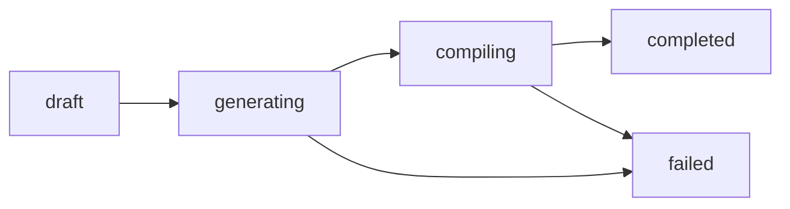

## Overview

Video projects progress through multiple status stages as AI clips are generated and compiled. This page explains the status lifecycle, how to track real-time progress, and how to handle errors.

## Status Values

<ParamField path="status" type="string">
  The current state of the video project. Possible values:
  
  - **draft** - Initial state, ready to start generation
  - **generating** - AI clips being created in parallel
  - **compiling** - FFmpeg merging clips into final video
  - **completed** - Video ready for download
  - **failed** - Error occurred during generation
</ParamField>

## Status Lifecycle



<Steps>
  <Step title="draft">
    **Initial state** after project creation
    
    - Clips are configured but not processed
    - `clipCount` is set
    - `estimatedCost` is calculated
    - Ready to trigger generation
  </Step>
  
  <Step title="generating">
    **AI clip generation** in progress
    
    - Kling AI model processes each clip (2-5 minutes each)
    - Up to 3 clips generated in parallel
    - `completedClipCount` increments as clips finish
    - Transition clips generated between sequential clips
  </Step>
  
  <Step title="compiling">
    **FFmpeg compilation** in progress
    
    - All clips are merged into final video
    - Background music mixed at specified volume
    - AI-generated ambient audio added (if enabled)
    - Output encoded as H.264 MP4
  </Step>
  
  <Step title="completed">
    **Video is ready**
    
    - `finalVideoUrl` contains download link
    - `thumbnailUrl` contains preview image
    - `durationSeconds` shows total video length
    - `actualCost` records final cost in cents
  </Step>
  
  <Step title="failed">
    **Error occurred**
    
    - `errorMessage` contains failure reason
    - `completedClipCount` shows how many clips succeeded
    - Manual review required to retry
  </Step>
</Steps>

## Querying Project Status

Fetch the current status from the database:

```typescript
// From source: lib/db/queries.ts
import { db } from "@/lib/db";
import { videoProject } from "@/lib/db/schema";
import { eq } from "drizzle-orm";

async function getVideoProjectStatus(videoProjectId: string) {
  const project = await db.query.videoProject.findFirst({
    where: eq(videoProject.id, videoProjectId),
    columns: {
      id: true,
      name: true,
      status: true,
      clipCount: true,
      completedClipCount: true,
      estimatedCost: true,
      actualCost: true,
      finalVideoUrl: true,
      thumbnailUrl: true,
      durationSeconds: true,
      errorMessage: true,
      triggerRunId: true,
    },
  });
  
  return project;
}
```

## Real-Time Progress Tracking

Use Trigger.dev's real-time hooks to monitor generation progress:

```typescript
// From source: components/video/video-progress.tsx
import { useRealtimeRun } from "@trigger.dev/react-hooks";

interface VideoProgressProps {
  videoProjectId: string;
  runId: string;
  publicAccessToken: string;
}

export function VideoProgress({ runId, publicAccessToken }: VideoProgressProps) {
  const { run } = useRealtimeRun(runId, {
    accessToken: publicAccessToken,
  });
  
  // Status metadata structure from trigger/video-orchestrator.ts:22-27
  const status = run?.metadata?.status as {
    step: "starting" | "generating" | "compiling" | "completed" | "failed";
    label: string;
    clipIndex?: number;
    totalClips?: number;
    progress?: number; // 0-100
  };
  
  return (
    <div className="space-y-4">
      <div>
        <p className="text-sm font-medium">{status?.label}</p>
        <p className="text-xs text-muted-foreground">
          {status?.step}
        </p>
      </div>
      
      {status?.progress !== undefined && (
        <div className="space-y-2">
          <div className="flex justify-between text-xs">
            <span>Progress</span>
            <span>{status.progress}%</span>
          </div>
          <progress
            value={status.progress}
            max={100}
            className="w-full"
          />
        </div>
      )}
      
      {status?.clipIndex !== undefined && (
        <p className="text-sm">
          Processing clip {status.clipIndex} of {status.totalClips}
        </p>
      )}
    </div>
  );
}
```

## Progress Stages

The `metadata.status` object updates throughout generation:

| Step | Label | Progress |
|------|-------|----------|
| `starting` | "Starting video generation..." | 5% |
| `generating` | "Generating 8 clips..." | 10-70% |
| `compiling` | "Compiling final video..." | 75-95% |
| `completed` | "Video ready!" | 100% |
| `failed` | Error message | N/A |

## Database Schema

```typescript
// From source: lib/db/schema.ts:247-302
export const videoProject = pgTable("video_project", {
  id: text("id").primaryKey(),
  status: text("status").notNull().default("draft"),
  
  // Progress tracking
  clipCount: integer("clip_count").notNull().default(0),
  completedClipCount: integer("completed_clip_count").notNull().default(0),
  
  // Cost tracking
  estimatedCost: integer("estimated_cost").notNull().default(0), // cents
  actualCost: integer("actual_cost"), // cents, set when completed
  
  // Output
  finalVideoUrl: text("final_video_url"),
  thumbnailUrl: text("thumbnail_url"),
  durationSeconds: integer("duration_seconds"),
  
  // Error handling
  errorMessage: text("error_message"),
  
  // Trigger.dev integration
  triggerRunId: text("trigger_run_id"),
  triggerAccessToken: text("trigger_access_token"),
});
```

## Polling Pattern

For clients without WebSocket support, poll the database:

```typescript
async function pollVideoStatus(videoProjectId: string): Promise<void> {
  const MAX_ATTEMPTS = 360; // 30 minutes (5s interval)
  const INTERVAL = 5000; // 5 seconds
  
  for (let i = 0; i < MAX_ATTEMPTS; i++) {
    const project = await getVideoProjectStatus(videoProjectId);
    
    if (project?.status === "completed") {
      console.log("Video ready!", project.finalVideoUrl);
      return;
    }
    
    if (project?.status === "failed") {
      throw new Error(`Video generation failed: ${project.errorMessage}`);
    }
    
    // Wait before next poll
    await new Promise(resolve => setTimeout(resolve, INTERVAL));
  }
  
  throw new Error("Video generation timeout after 30 minutes");
}
```

<Warning>
Avoid polling more frequently than every 5 seconds to prevent excessive database load.
</Warning>

## Progress Calculation

Progress is calculated based on completed clips:

```typescript
// From source: trigger/video-orchestrator.ts:155-162
function calculateProgress(
  completedClips: number,
  totalClips: number,
  stage: "generating" | "compiling"
): number {
  const clipProgress = (completedClips / totalClips) * 60; // 60% for clips
  const baseProgress = stage === "generating" ? 10 : 75;
  
  return Math.min(100, baseProgress + clipProgress);
}
```

## Clip Status Tracking

Individual clip status can be monitored:

```typescript
// From source: lib/db/schema.ts:308-366
export const videoClip = pgTable("video_clip", {
  id: text("id").primaryKey(),
  videoProjectId: text("video_project_id").notNull(),
  status: text("status").notNull().default("pending"),
  clipUrl: text("clip_url"), // Set when completed
  errorMessage: text("error_message"),
  sequenceOrder: integer("sequence_order").notNull(),
});

// Query all clips for a project
async function getVideoClipStatuses(videoProjectId: string) {
  const clips = await db.query.videoClip.findMany({
    where: eq(videoClip.videoProjectId, videoProjectId),
    orderBy: [asc(videoClip.sequenceOrder)],
    columns: {
      id: true,
      sequenceOrder: true,
      status: true,
      clipUrl: true,
      errorMessage: true,
    },
  });
  
  return clips;
}
```

## Error Messages

Common error messages and their meanings:

<AccordionGroup>
  <Accordion title="Video project not found">
    **Cause:** Invalid `videoProjectId` or project was deleted
    
    **Solution:** Verify the project ID exists in your workspace
  </Accordion>
  
  <Accordion title="No clips to generate">
    **Cause:** Video project has zero clips configured
    
    **Solution:** Add at least one clip before triggering generation
  </Accordion>
  
  <Accordion title="Clip generation timeout (ID: clip_xyz)">
    **Cause:** Kling AI model took longer than 10 minutes to generate clip
    
    **Solution:** Retry generation. Check if source image URL is accessible.
  </Accordion>
  
  <Accordion title="Kling API error: Invalid image format">
    **Cause:** Source image is not in a supported format (JPG, PNG, WebP)
    
    **Solution:** Re-upload image in a supported format
  </Accordion>
  
  <Accordion title="FFmpeg compilation failed">
    **Cause:** Error merging clips (corrupted video files, format mismatch)
    
    **Solution:** Check `completedClipCount`. If clips are missing, retry generation.
  </Accordion>
  
  <Accordion title="Storage upload failed">
    **Cause:** Supabase Storage is unavailable or quota exceeded
    
    **Solution:** Check Supabase dashboard for storage limits and service status
  </Accordion>
</AccordionGroup>

## Handling Failed Generations

When a video fails (`status: "failed"`):

1. **Check error message** for the specific cause
2. **Review completed clips** via `completedClipCount`
3. **Inspect individual clip errors** in the `video_clip` table
4. **Delete and recreate** the project if needed
5. **Contact support** if errors persist

<Note>
Failed videos do not automatically retry. Manual intervention is required to review and restart generation.
</Note>

## Monitoring Best Practices

<Tabs>
  <Tab title="Real-time (Recommended)">
    Use Trigger.dev's WebSocket connection for instant updates:
    
    ```tsx
    const { run } = useRealtimeRun(runId, { accessToken });
    ```
    
    ✅ No polling overhead  
    ✅ Instant status updates  
    ✅ Progress percentage available
  </Tab>
  
  <Tab title="Polling">
    Query database every 5-10 seconds:
    
    ```tsx
    setInterval(() => {
      const project = await getVideoProjectStatus(id);
      updateUI(project);
    }, 5000);
    ```
    
    ⚠️ Adds database load  
    ⚠️ Delayed updates (5s lag)  
    ✅ Works without WebSockets
  </Tab>
  
  <Tab title="Webhooks">
    Configure Trigger.dev to POST status updates to your endpoint:
    
    ```typescript
    // trigger.config.ts
    export default defineConfig({
      project: "ai-studio",
      onSuccess: async (run) => {
        await fetch("https://your-api.com/webhook/video-complete", {
          method: "POST",
          body: JSON.stringify({ videoProjectId: run.payload.videoProjectId }),
        });
      },
    });
    ```
    
    ✅ No client-side polling  
    ✅ Server-to-server communication  
    ⚠️ Requires webhook endpoint
  </Tab>
</Tabs>

## Example: Complete Status Check

```typescript
interface VideoStatusResponse {
  id: string;
  name: string;
  status: "draft" | "generating" | "compiling" | "completed" | "failed";
  progress: {
    completed: number;
    total: number;
    percentage: number;
  };
  output?: {
    videoUrl: string;
    thumbnailUrl: string;
    duration: number;
  };
  cost: {
    estimated: number; // cents
    actual?: number; // cents
  };
  error?: string;
}

async function getCompleteVideoStatus(
  videoProjectId: string
): Promise<VideoStatusResponse> {
  const project = await getVideoProjectStatus(videoProjectId);
  const clips = await getVideoClipStatuses(videoProjectId);
  
  if (!project) {
    throw new Error("Video project not found");
  }
  
  const percentage = project.clipCount > 0
    ? Math.round((project.completedClipCount / project.clipCount) * 100)
    : 0;
  
  return {
    id: project.id,
    name: project.name,
    status: project.status,
    progress: {
      completed: project.completedClipCount,
      total: project.clipCount,
      percentage,
    },
    output: project.finalVideoUrl ? {
      videoUrl: project.finalVideoUrl,
      thumbnailUrl: project.thumbnailUrl!,
      duration: project.durationSeconds!,
    } : undefined,
    cost: {
      estimated: project.estimatedCost,
      actual: project.actualCost ?? undefined,
    },
    error: project.errorMessage ?? undefined,
  };
}
```

## Next Steps

<CardGroup cols={2}>
  <Card title="Create Video" icon="plus" href="/api-reference/videos/create">
    Create a new video project
  </Card>
  <Card title="Compile Video" icon="video" href="/api-reference/videos/compile">
    Trigger video generation
  </Card>
</CardGroup>
