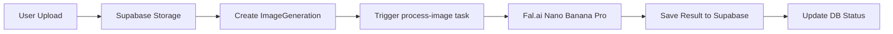
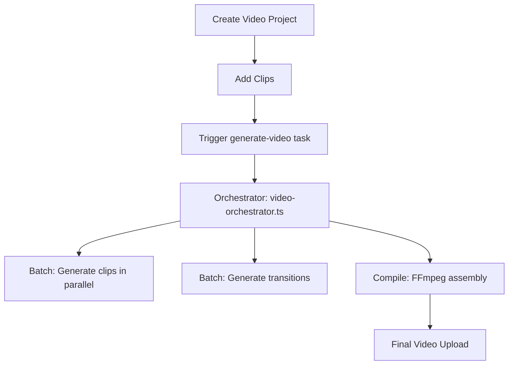

## Overview

AI Studio is built on **Next.js 16** with the App Router, leveraging React Server Components and Server Actions for optimal performance and developer experience. The platform processes real estate images and videos through AI models orchestrated by background jobs.

## Technology Stack

### Frontend
- **Next.js 16.1.1** - React framework with App Router
- **React 19.2.3** - UI library with Server Components
- **Tailwind CSS 4** - Utility-first styling
- **shadcn/ui** - Component library built on Radix UI
- **Tanstack Table** - Data tables and virtualization

### Backend
- **Better Auth** - Authentication with email/password, workspace management, and admin features
- **Drizzle ORM** - Type-safe database queries
- **PostgreSQL** - Primary database (Supabase)
- **Trigger.dev v4** - Background job orchestration
- **Fal.ai** - AI model APIs (Nano Banana Pro, Kling Video)

### Infrastructure
- **Supabase** - Database and file storage
- **Stripe** - Payment processing
- **Resend** - Email delivery
- **Vercel** - Deployment and hosting

## Architecture Patterns

### Multi-Tenant Workspace Model

Every user belongs to a **workspace**, which serves as the billing and organizational boundary:

```typescript
// User automatically gets a workspace on signup
// See lib/auth.ts databaseHooks.user.create
const workspace = {
  id: nanoid(),
  name: `${user.name}'s Workspace`,
  slug: `user-${workspaceId.slice(0, 6)}`,
};

user.workspaceId = workspace.id;
user.role = "owner"; // owner | admin | member
```

### Project Hierarchy

```
Workspace
├── Projects (Image Enhancement)
│   ├── imageGeneration (multiple images per project)
│   └── projectPayment (Stripe or invoice)
└── VideoProjects (Video Creation)
    ├── videoClips (multiple clips per video)
    └── musicTrack (optional background music)
```

## Data Flow

### Image Processing Flow



**Implementation:**

1. **Upload** - Client uploads to Supabase Storage via signed URL
2. **Database Record** - Server action creates `imageGeneration` record
3. **Background Job** - Trigger.dev task `process-image` processes the image
4. **AI Processing** - Fal.ai Nano Banana Pro enhances the image
5. **Storage** - Result saved to Supabase Storage
6. **Status Update** - Database updated to `completed` or `failed`

See `trigger/process-image.ts:30` for implementation.

### Video Generation Flow



**Implementation:**

1. **Setup** - User creates video project and adds clips
2. **Orchestration** - `video-orchestrator.ts:29` coordinates all tasks
3. **Clip Generation** - Each clip processed by Kling Video API (parallel)
4. **Transitions** - Seamless transitions generated between clips
5. **Compilation** - FFmpeg concatenates clips with music overlay
6. **Delivery** - Final video uploaded to Supabase

See `trigger/video-orchestrator.ts:39` for full workflow.

## File Organization

### App Router Structure

```
app/
├── (auth)/              # Authentication routes (login, signup)
├── (main)/              # Main application (dashboard, projects)
│   ├── dashboard/       # Project gallery
│   ├── projects/        # Image project details
│   ├── videos/          # Video project wizard
│   └── settings/        # User and workspace settings
├── admin/               # Admin panel for system admins
└── api/                 # API routes
    ├── auth/[...all]/   # Better Auth handler
    ├── upload/          # Signed upload URLs
    └── webhooks/        # Stripe webhooks
```

### Library Organization

```
lib/
├── actions/             # Server Actions (mutations)
│   ├── projects.ts      # Project CRUD
│   ├── images.ts        # Image generation
│   ├── video.ts         # Video creation
│   └── payments.ts      # Stripe integration
├── db/
│   ├── schema.ts        # Drizzle schema definitions
│   ├── queries.ts       # Database queries
│   └── index.ts         # Database client
├── auth.ts              # Better Auth configuration
├── fal.ts               # Fal.ai client and types
└── supabase.ts          # Supabase storage helpers
```

### Background Jobs

```
trigger/
├── process-image.ts            # Image enhancement workflow
├── inpaint-image.ts            # Inpainting for image edits
├── video-orchestrator.ts       # Main video generation coordinator
├── generate-video-clip.ts      # Individual clip generation
├── generate-transition-clip.ts # Seamless transition generation
└── compile-video.ts            # FFmpeg video compilation
```

## Server Actions Pattern

AI Studio uses Next.js Server Actions for all mutations. Server Actions provide:

- **Type Safety** - Full TypeScript support end-to-end
- **Security** - Server-side validation and authorization
- **Progressive Enhancement** - Works without JavaScript
- **Optimistic Updates** - Immediate UI feedback

**Example:** Creating a project

```typescript
// lib/actions/projects.ts:28
export async function createProjectAction(
  formData: FormData
): Promise<ActionResult<Project>> {
  const session = await auth.api.getSession({ headers: await headers() });
  
  if (!session) {
    return { success: false, error: "Unauthorized" };
  }

  // Get user's workspace
  const user = await db.query.user.findFirst({
    where: eq(user.id, session.user.id)
  });

  // Create project in workspace
  const project = await createProjectQuery({
    workspaceId: user.workspaceId,
    userId: session.user.id,
    name: formData.get("name"),
    styleTemplateId: formData.get("styleTemplateId"),
  });

  revalidatePath("/dashboard");
  return { success: true, data: project };
}
```

## Real-Time Updates

Background job progress is tracked using Trigger.dev's metadata system:

```typescript
// trigger/process-image.ts:44
metadata.set("status", {
  step: "processing",
  label: "Enhancing image…",
  progress: 50,
} satisfies ProcessImageStatus);
```

The frontend polls the Trigger.dev API to display real-time progress:

```typescript
// Using @trigger.dev/react-hooks
const { run } = useRealtimeRun(runId);
const progress = run?.metadata?.status?.progress ?? 0;
```

## Payment Integration

### Dual Payment Model

1. **Stripe** - Credit card payments (international customers)
2. **Invoice** - B2B invoicing via Fiken API (Norwegian customers)

Payment validation occurs before processing:

```typescript
// Project payment must complete before AI processing begins
const payment = await getProjectPayment(projectId);

if (payment.status !== "completed") {
  throw new Error("Payment required");
}

// Start background job only after payment
await triggerProcessImage(projectId);
```

See the [Authentication](/development/authentication) and [Background Jobs](/development/background-jobs) sections for more details on specific subsystems.

## Environment Variables

Required configuration (see `.env.example`):

```bash
# Database
DATABASE_URL=postgresql://...

# Authentication
BETTER_AUTH_URL=https://yourdomain.com
BETTER_AUTH_SECRET=... # Generate with: openssl rand -base64 32

# AI Services
FAL_API_KEY=... # Fal.ai for image/video processing

# Storage
NEXT_PUBLIC_SUPABASE_URL=https://...supabase.co
SUPABASE_SECRET_KEY=...

# Payments
STRIPE_SECRET_KEY=sk_...
NEXT_PUBLIC_STRIPE_PUBLISHABLE_KEY=pk_...

# Email
RESEND_API_KEY=re_...

# Background Jobs
TRIGGER_SECRET_KEY=...
```

## Development Workflow

```bash
# Start Next.js dev server
pnpm dev

# Start Trigger.dev local worker (separate terminal)
pnpm trigger

# Push database schema changes
pnpm db:push

# Open Drizzle Studio (database GUI)
pnpm db:studio

# Preview email templates
pnpm email
```

## Deployment

The application is designed for deployment on **Vercel**:

1. **Frontend** - Vercel Edge Network
2. **Database** - Supabase (PostgreSQL)
3. **Background Jobs** - Trigger.dev Cloud
4. **Storage** - Supabase Storage

```bash
# Deploy background jobs to Trigger.dev
pnpm trigger:deploy

# Deploy frontend to Vercel
git push origin main # Auto-deploys via GitHub integration
```

## Performance Optimizations

### Database Indexes

All foreign keys and frequently queried fields have indexes:

```typescript
// lib/db/schema.ts:191
(table) => [
  index("project_workspace_idx").on(table.workspaceId),
  index("project_user_idx").on(table.userId),
  index("project_status_idx").on(table.status),
]
```

### Image Optimization

- **Next.js Image** component for automatic optimization
- **Supabase CDN** for fast global delivery
- **WebP/JPEG** format support

### Parallel Processing

Video clips generate in parallel using Trigger.dev batch operations:

```typescript
// trigger/video-orchestrator.ts:91
const clipResults = await generateVideoClipTask.batchTriggerAndWait(
  clips.map(clip => ({ payload: { clipId: clip.id } }))
);
```

## Security

### Authentication & Authorization

- **Better Auth** - Secure password hashing (bcrypt)
- **Session-based auth** - HttpOnly cookies
- **Row-level security** - All queries filter by `workspaceId`
- **Admin impersonation** - Audit logging for support

### Data Validation

- **Server Actions** - All inputs validated server-side
- **Drizzle ORM** - Type-safe queries prevent SQL injection
- **Zod schemas** - Runtime validation for API inputs

### File Upload Security

- **Signed URLs** - Time-limited upload tokens
- **Content-Type validation** - Only images/videos accepted
- **Size limits** - Enforced at storage layer

See [Database Schema](/development/schema) for complete data model documentation.